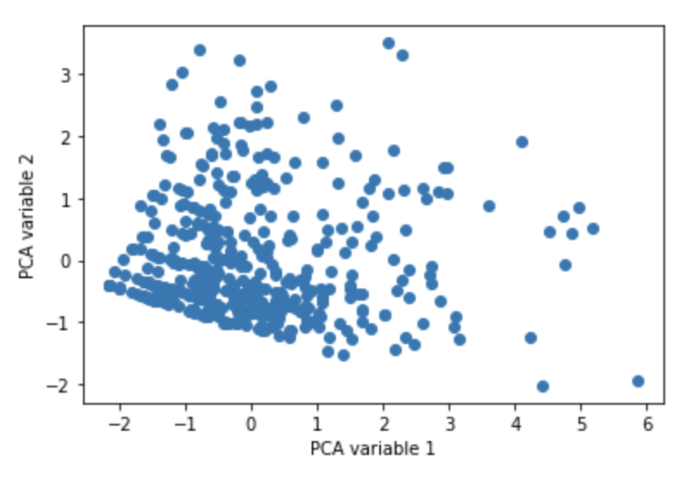
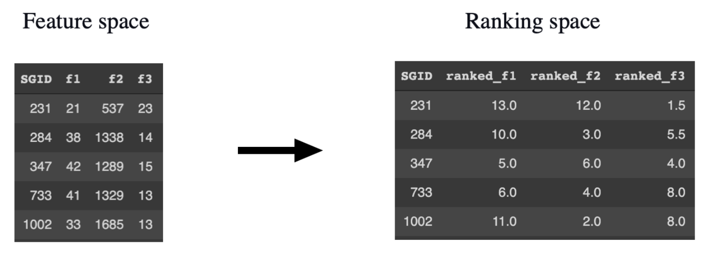
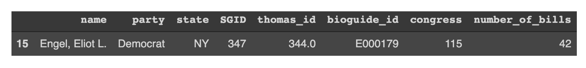

# Analysis of 115th US Congress data by using Anomaly detection

This repository contains the script for analysing the 115th US Congress data and find out which member is the most important person in this Congress.

## Implementation
This is an anomaly detection problem where we are interested in finding an individual who is exceptionally good. My criteria for judging an individual
as the important person is based on the leadership quality and activeness of an individual in Congress. We will start by defining the feature space. 
Since the features can be correlated, so we will use PCA to find the uncorrelated variables in 2D space. Then, we will proceed with outlier detection. 
In Gaussian distribution, outliers are the points which are 3σ away from the mean. So, we will find a list of outliers and find the best out of them by 
ranking their features. Last, we will define a three-dimensional space in which each outlier is represented as a vector defined by the ranking space and 
will calculate the Euclidean distance of each outlier from the origin and find the minimum.

It is divided into the following sections:

* Getting the necessary libraries & data
* Performing feature engineering to extract features
* PCA Analysis
* Outlier Detection

## Approach
Let us define our feature space:
* No. of bills proposed
* No. of times members supported his bills
* Congress periods

We can use these features to find an outlier which corresponds to an individual who is exceptionally good in these qualities. The features could be correlated, 
e.g., no. of people supported the proposed bills depends on the no. of bills an individual proposed. So, we have to decorrelate them by using the Principal 
Component Analysis (PCA) which will return the uncorrelated variables in 2D space. These variables are Gaussian distributed with µ=0 and σ, as shown below:

## Outlier Detection
Outlier Detection
In Gaussian distribution, outliers are the points which are 3σ away from the mean. So, we will find a list of outliers in the figure. 
This will help us to remove the noise in the data, i.e. by selecting the best and eliminating the rest of the MPs. Now we are interested in finding 
the best out of these outliers. So we will rank all the three features of the outliers in descending order, as shown below:

Let’s consider three-dimensional space in which each outlier is represented as a vector defined by the ranking space. We want to find an outlier which has 
higher ranking among others, i.e. a vector which is closer to the origin. So, we will calculate the Euclidean distance of each vector from the origin and 
find the minimum.

## Result
Engel, Eliot L. is found to be an important person who is 3σ better than the rest of the members.

